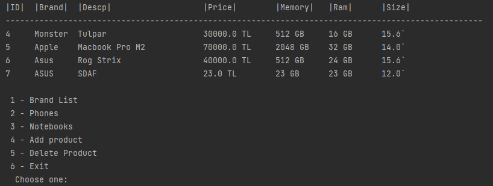
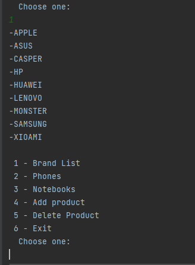
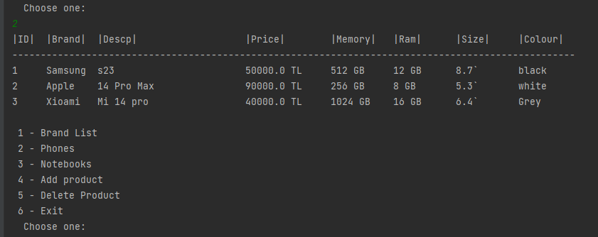
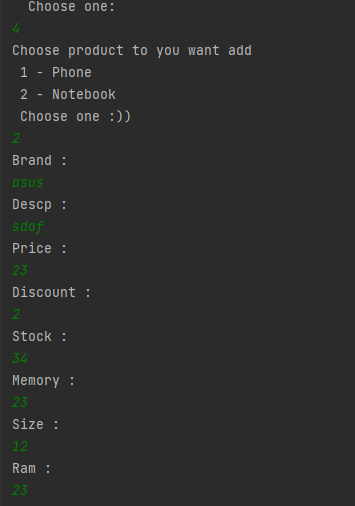
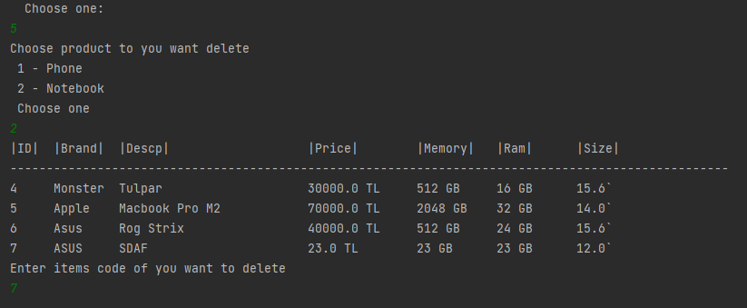
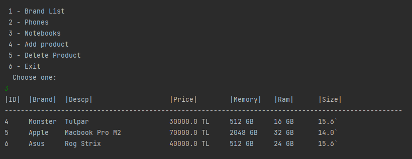

# PatikaStore

The Patika team has decided to open a virtual store that sells electronic devices, and they want the product management system of this store to be developed by you, the volunteers of Patika.

- The name of the virtual store will be "PatikaStore."

- Brands will be created in the store, and products will be associated with these brands.
  - id: The unique number of the brand in the system.
  - name: The name of the brand.
  - Brands should always be listed in alphabetical order.
  - Brands should be added statically in code blocks in the following order.
  - Brands: Samsung, Lenovo, Apple, Huawei, Casper, Asus, HP, Xiaomi, Monster

- Currently, two types of product categories are planned to be sold in the store: Mobile Phones and Notebooks. It should be possible to add different product categories later.

- Specifications of Mobile Phone products:
  - The unique number of the product in the system.
  - Unit price.
  - Discount rate.
  - Stock quantity.
  - Product name.
  - Brand information (to be chosen from the existing brands in the system).
  - Memory capacity of the phone (128 GB, 64 GB).
  - Screen size (6.1 inches).
  - Battery power (4000).
  - RAM (6 MB).
  - Color (Black, Red, Blue).
  - Specifications of Notebook products:

- The unique number of the product in the system.
  - Unit price.
  - Discount rate.
  - Stock quantity.
  - Product name.
  - Brand information (to be chosen from the existing brands in the system).
  - RAM (8 GB).
  - Storage (512 SSD).
  - Screen size (14 inches).
  - Users should be able to list products in the relevant category (Notebook, Mobile Phones, etc.) through the system.

- When listing products, they should be displayed in a tabular format on the console screen (System.out.format() can be used).

- Users should be able to add products and choose the product category (Mobile Phone, Notebook, etc.).

- Users should be able to delete products based on their unique numbers.

- Users should be able to filter and list products based on their unique numbers and brands.

## Photos 
### Notebook Listing

### Brand Sorting

### Phone Listing

### Product Adding

### After Adding

### After Deleting 
